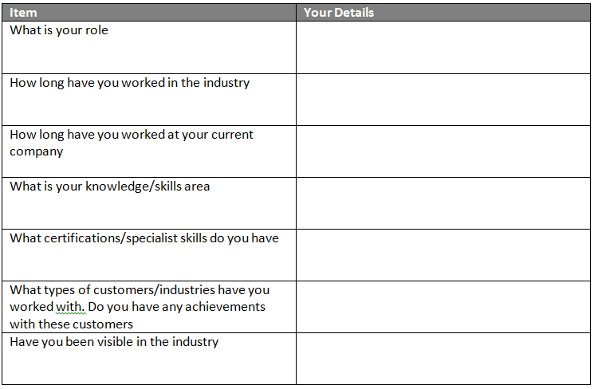

# How to write a Short Biography

A biography or simply bio is a detailed description or account of a person’s life

```
Bibliography 
(n.d.). Biography. Retrieved from Wikipedia: http://en.wikipedia.org/wiki/Biography
```
The aim of a Biography on your CV, LinkedIn Profile, White Paper or other documentation is to provide a short paragraph about yourself.  

This ideally should be a single paragraph that is to the point and informs the reader of your background, expertise and skills. It should be brief but informatibve and show your strong points.

When forming your Biography I have found the best way is to follow the framework shown below.


## Listing your details

Your details for the Short Biography may seem hard to bring to mind, so this page is aimed to help categorise the information. Having an up to date CV and using this as a source of information also helps compile your biography. This list is by no means exhaustive, although remember – this is a short biography.

Getting the information into a logical order brings the story to the biography and the table below is based around one possible layout of the information (Click pictures for a bigger version).




## Picking the right points

This will in the main be down to the information you have recorded. When doing this stage, think about the reader and what they would like to know about you in the 2 minutes they will spend reading your biography. You only need to pick the top 1 or 2 in each area. Highlight or mark these to use in the next stage.

## Writing the Biography

The key to writing a Short Biography is to be factual, to the point, structured and start with the most important facts to draw the reader in.

Write out the points into a series of short sentences that follow the logical order to make a short history of your working life. Below is an earlier version of my biography as an example of how this could work.

I am a highly experienced Architect with 27 years working in the IT Industry.  I have extensive knowledge in the design and deployment of platform, systems and network architectures to support both web and traditionally based business applications and services. Proven track record acquired through continual client engagement and delivery of leading edge infrastructures, all of which have delivered positive results for end-clients, including IT cost reduction, expansion of service capability and increased revenues. I am a Fellow of the British Computer Society, Chartered IT Professional.

## Review

Getting your biography reviewed before you publish is a good test to check what you have written and that you have got your key messages in the biography.  This could be a colleague, friend, mentor or someone you dont know. Ask the reviewer to feed back to you what they have learnt about you.


- [Original Source for this in my Blog - How to write a Short Biography for your CV and LinkedIn profile](https://maxhemingway.com/2015/08/18/how-to-write-a-short-biography-for-your-cv-and-linkedin-profile/)